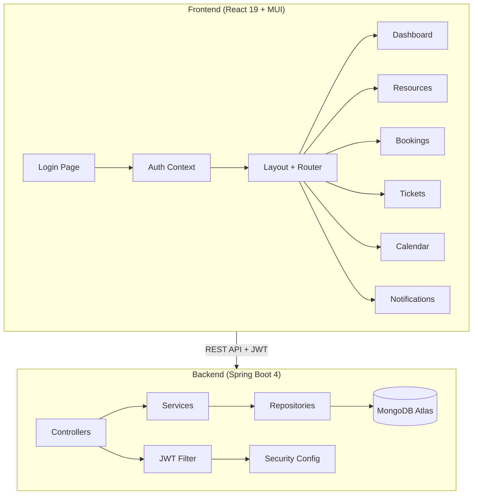
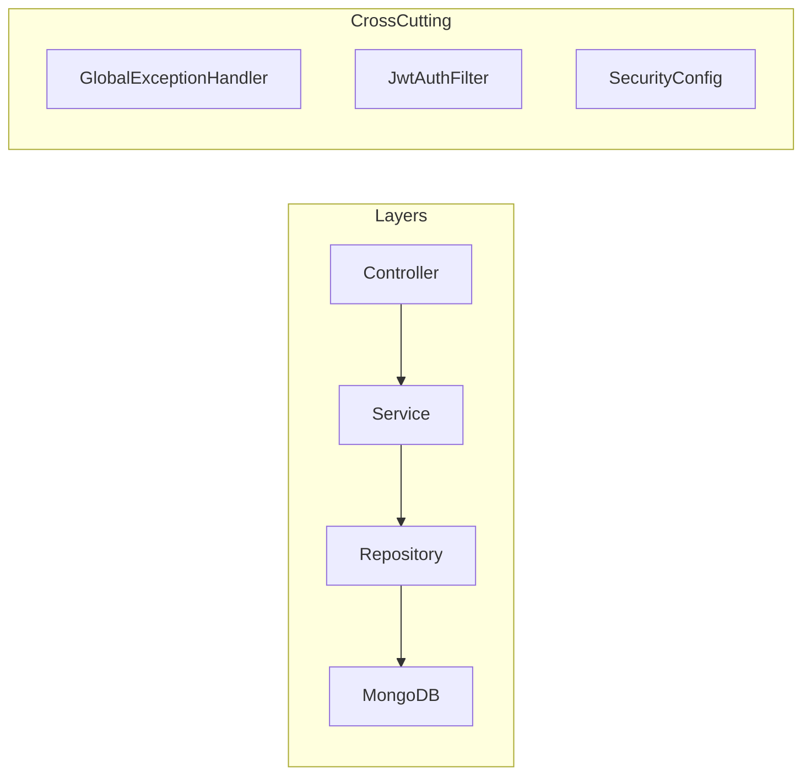

# 🏫 Smart Campus Operations Hub

> **IT3030 – Platform-based Application Framework | Y3S1 | WD-10**

A comprehensive full-stack web application for managing campus facilities, bookings, maintenance tickets, and notifications. Built with **Spring Boot 4** (backend) and **React 19 + Material-UI** (frontend), backed by **MongoDB Atlas**.

---

## 📋 Table of Contents

- [Features](#-features)
- [Architecture](#-architecture)
- [Tech Stack](#-tech-stack)
- [Setup Instructions](#-setup-instructions)
- [API Endpoints](#-api-endpoints)
- [Innovation Features](#-innovation-features)
- [Team Contribution Matrix](#-team-contribution-matrix)
- [Testing](#-testing)
- [Non-Functional Requirements](#-non-functional-requirements)
- [Screenshots](#-screenshots)

---

## ✨ Features

### Module A – Facilities & Assets Catalogue
- CRUD operations for campus resources (Lecture Halls, Labs, Meeting Rooms, Equipment)
- Search and filter by type, capacity, location, status
- Availability windows management

### Module B – Booking Management
- Create bookings with **overlap detection** (409 Conflict)
- Admin approval/rejection workflow
- User self-cancellation
- Resource calendar view (Innovation Feature)

### Module C – Maintenance & Incident Ticketing
- Create tickets with image attachments (max 3)
- Priority levels: LOW, MEDIUM, HIGH, URGENT
- Technician assignment workflow
- Comments with ownership enforcement (only owner can edit/delete)
- Status tracking: OPEN → IN_PROGRESS → RESOLVED → CLOSED

### Module D – Notifications
- Automatic notifications for booking approvals/rejections
- Ticket status change alerts
- New comment notifications
- Bell icon with unread badge and dropdown panel
- Mark as read / Mark all as read

### Module E – Authentication & Authorization
- JWT-based authentication
- OAuth2 Google integration (configurable)
- Role-based access control: USER, ADMIN, TECHNICIAN
- Demo login for testing

---

## 🏗 Architecture





---

## 🛠 Tech Stack

| Layer | Technology |
|-------|-----------|
| Backend | Spring Boot 4.0.5, Java 17 |
| Frontend | React 19, TypeScript, Material-UI 5 |
| Database | MongoDB Atlas |
| Auth | JWT (jjwt 0.12.6), OAuth2 Google |
| Charts | Recharts |
| Testing | JUnit 5, MockMvc, Jest, React Testing Library |
| CI/CD | GitHub Actions |

---

## 🚀 Setup Instructions

### Prerequisites
- Java 17+
- Node.js 18+
- Maven 3.9+
- MongoDB Atlas account (already configured)

### Backend Setup

```bash
cd backend

# Set environment variables (optional – for Google OAuth2)
# export GOOGLE_CLIENT_ID=your-google-client-id
# export GOOGLE_CLIENT_SECRET=your-google-client-secret

# Run the backend
mvn spring-boot:run
```

Backend runs on **http://localhost:8081**

### Frontend Setup

```bash
cd frontend

# Install dependencies
npm install

# Start development server
npm run dev
# OR
npm start
```

Frontend runs on **http://localhost:3000**

### Environment Variables

| Variable | Description | Default |
|----------|-------------|---------|
| `GOOGLE_CLIENT_ID` | Google OAuth2 Client ID | demo-client-id |
| `GOOGLE_CLIENT_SECRET` | Google OAuth2 Client Secret | demo-client-secret |
| `REACT_APP_API_URL` | Backend API URL | http://localhost:8081 |

### Default Accounts

The application automatically seeds three default accounts on startup for testing the different role flows:

- **Admin**: `admin@sliit.lk` | Password: `admin123`
- **Technician**: `tech@sliit.lk` | Password: `tech123`
- **Student (User)**: `user@sliit.lk` | Password: `user123`

Alternatively, you can use the **"Sign in with Google"** button on the login page if you have configured the `GOOGLE_CLIENT_ID` and `GOOGLE_CLIENT_SECRET` in your backend properties. Google accounts will be mapped to the `USER` role automatically, unless the email starts with `admin@` or `tech@`.

---

## 📡 API Endpoints

### Authentication (`/api/auth`)

| Method | Path | Description | Roles |
|--------|------|-------------|-------|
| POST | `/api/auth/login` | Demo login (email + name) | Public |
| GET | `/api/auth/me` | Get current user | Authenticated |
| GET | `/api/auth/users` | List all users | ADMIN |
| PUT | `/api/auth/users/{id}/role` | Update user role | ADMIN |

### Resources (`/api/resources`)

| Method | Path | Description | Roles |
|--------|------|-------------|-------|
| GET | `/api/resources` | List resources (with filters) | Public |
| GET | `/api/resources/{id}` | Get resource by ID | Public |
| POST | `/api/resources` | Create resource | ADMIN |
| PUT | `/api/resources/{id}` | Update resource | ADMIN |
| DELETE | `/api/resources/{id}` | Delete resource | ADMIN |

### Bookings (`/api/bookings`)

| Method | Path | Description | Roles |
|--------|------|-------------|-------|
| POST | `/api/bookings` | Create booking (409 on overlap) | Authenticated |
| GET | `/api/bookings` | List all bookings (with filters) | ADMIN |
| GET | `/api/bookings/me` | Get my bookings | Authenticated |
| GET | `/api/bookings/{id}` | Get booking by ID | Authenticated |
| PUT | `/api/bookings/{id}/approve` | Approve booking | ADMIN |
| PUT | `/api/bookings/{id}/reject` | Reject booking | ADMIN |
| PUT | `/api/bookings/{id}/cancel` | Cancel own booking | Authenticated |
| GET | `/api/bookings/resource/{id}` | Get resource bookings (calendar) | Authenticated |

### Tickets (`/api/tickets`)

| Method | Path | Description | Roles |
|--------|------|-------------|-------|
| POST | `/api/tickets` | Create ticket (multipart/JSON) | Authenticated |
| GET | `/api/tickets` | List all tickets (with filters) | ADMIN |
| GET | `/api/tickets/me` | Get my tickets | Authenticated |
| GET | `/api/tickets/assigned` | Get assigned tickets | TECHNICIAN |
| GET | `/api/tickets/{id}` | Get ticket by ID | Authenticated |
| PUT | `/api/tickets/{id}/assign` | Assign technician | ADMIN |
| PUT | `/api/tickets/{id}/status` | Update status | ADMIN, TECHNICIAN |
| PUT | `/api/tickets/{id}/reject` | Reject ticket | ADMIN |

### Comments (`/api/tickets/{id}/comments`, `/api/comments/{id}`)

| Method | Path | Description | Roles |
|--------|------|-------------|-------|
| GET | `/api/tickets/{id}/comments` | Get ticket comments | Authenticated |
| POST | `/api/tickets/{id}/comments` | Add comment | Authenticated |
| PUT | `/api/comments/{id}` | Update comment (owner only) | Authenticated |
| DELETE | `/api/comments/{id}` | Delete comment (owner only) | Authenticated |

### Notifications (`/api/notifications`)

| Method | Path | Description | Roles |
|--------|------|-------------|-------|
| GET | `/api/notifications` | Get my notifications | Authenticated |
| GET | `/api/notifications/unread-count` | Get unread count | Authenticated |
| PUT | `/api/notifications/{id}/read` | Mark as read | Authenticated |
| PUT | `/api/notifications/read-all` | Mark all as read | Authenticated |

### Analytics (`/api/analytics`)

| Method | Path | Description | Roles |
|--------|------|-------------|-------|
| GET | `/api/analytics` | Get dashboard analytics | ADMIN |

---

## 💡 Innovation Features

### 1. Admin Analytics Dashboard
The admin dashboard provides real-time insights through interactive charts:
- **Most Booked Resources**: Bar chart showing the top 5 most reserved facilities
- **Tickets by Status**: Pie chart visualizing ticket distribution across statuses
- **Booking Trends**: Daily booking counts over the last 30 days
- **Peak Booking Hours**: Identifies the busiest times for resource reservations
- **Summary Cards**: Total counts for resources, bookings, tickets, and users

### 2. Resource Calendar View
A monthly calendar view for visualizing resource bookings:
- **Resource Selector**: Choose any campus resource to view its schedule
- **Month Navigation**: Browse forward and backward through months
- **Color-Coded Slots**: Bookings are color-coded by status (green=approved, orange=pending, red=rejected)
- **Time Slot Details**: Each booking shows time range and purpose on hover
- **Grid Layout**: Standard 7-column calendar grid with day headers

---

## 👥 Team Contribution Matrix

| Member | Modules | REST Endpoints (GET, POST, PUT, DELETE) |
|--------|---------|----------------------------------------|
| Member 1 | Module A – Resources | GET /resources, POST /resources, PUT /resources/{id}, DELETE /resources/{id} |
| Member 2 | Module B – Bookings | GET /bookings, POST /bookings, PUT /bookings/{id}/approve, PUT /bookings/{id}/cancel |
| Member 3 | Module C – Tickets & Comments | GET /tickets, POST /tickets, PUT /tickets/{id}/status, DELETE /comments/{id} |
| Member 4 | Module D & E – Notifications & Auth | GET /notifications, POST /auth/login, PUT /notifications/{id}/read, PUT /auth/users/{id}/role |

---

## 🧪 Testing

### Backend Tests (JUnit 5 + Mockito)
```bash
cd backend
mvn test
```

Tests cover:
- **BookingServiceTest**: Overlap detection, booking creation, approval/rejection flow, invalid time validation
- **CommentServiceTest**: Ownership enforcement for edit/delete, comment creation

### Frontend Tests (Jest + React Testing Library)
```bash
cd frontend
npm test
```

### Postman Collection
Import `postman_collection.json` from the project root into Postman. The collection includes:
- All 30+ endpoints organized by module
- Auto-token management (login sets the Bearer token)
- Test scripts for status code validation
- Variable-based URL management

### CI/CD (GitHub Actions)
The `.github/workflows/build.yml` pipeline:
1. Runs `mvn test` for backend on push to `main`
2. Runs `npm test` for frontend on push to `main`

---

## 📋 Non-Functional Requirements

| Requirement | Implementation |
|-------------|---------------|
| **Security** | JWT authentication, role-based access with @PreAuthorize, CORS configuration |
| **Validation** | Bean Validation (@Valid, @NotBlank, @NotNull, @Min) on all request DTOs |
| **Error Handling** | Global exception handler with proper HTTP status codes (400, 403, 404, 409, 500) |
| **Scalability** | Stateless JWT sessions, MongoDB Atlas cloud database |
| **Responsiveness** | Material-UI responsive grid, mobile sidebar drawer |
| **Performance** | Indexed MongoDB queries, lazy loading, notification polling |
| **Code Quality** | Separation of concerns (Controller → Service → Repository), DTOs, no entity exposure |
| **Documentation** | Comprehensive README, Postman collection, inline code comments |

---

## 📸 Screenshots

> Screenshots will be added after deployment.

| Page | Description |
|------|-------------|
| Login | Modern gradient login page with Google OAuth and email/password |
| Dashboard | Role-specific stats cards and admin analytics charts |
| Resources | Filterable card grid with type-coded borders |
| Bookings | Table view with approve/reject/cancel actions |
| Tickets | Card grid with priority and status badges |
| Ticket Detail | Full detail view with comments section |
| Calendar | Monthly resource booking calendar (Innovation) |
| Users | Admin user management with role assignment |

---

## 📄 License

This project is developed for academic purposes as part of the IT3030 module at SLIIT.
